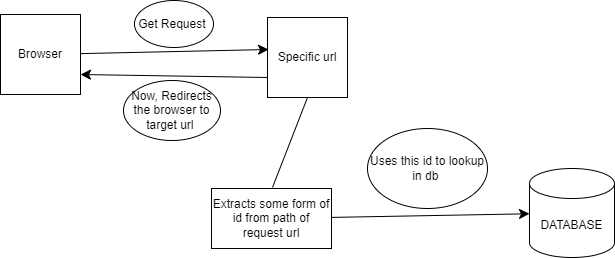

### URLSHORTENER-RUST

A simple URL shortener service implemented in Rust using SQLx and Axum.


## Overview
This project aims to provide a lightweight URL shortening service with a RESTful API. It utilizes Rust for its performance and reliability, SQLx for database interactions, and Axum for handling HTTP requests efficiently.


## Features

- Shorten URLs: Convert long URLs into short, manageable links.

- Redirect: Redirect users from short URLs to the original long URLs.


## Diagram
Below is a visual representation of how the URL shortener works:




### Description of the Diagram:
- Browser: Represents the client making a request to shorten a URL (/shorten endpoint).

- Get Request: Endpoint (/shorten) where clients send a POST request with a long URL to be shortened.

- Specific URL: Endpoint (/:short_id) where short URLs redirect to the original long URLs.

- DATABASE: Represents the database where mappings between short and long URLs are stored.

- Extracts some form of id from path of request url: Logic to extract the short ID from the request path.

- Uses this id to lookup in db: Logic to query the database for the original long URL corresponding to the short ID.

- Now, Redirects the browser to target url: Logic to redirect the client to the original long URL.

## Setup and Usage

### Prerequisites:

1. Rust programming language installed.

2. PostgreSQL database configured.
Installation:

### Installation:


### Running the Server:

``` cargo run --release ```

### API Endpoints:

1. Shorten URL: POST /shorten - Shorten a long URL. Example: 
``` curl -X POST -d '{"url": "https://www.example.com"}' http://localhost:30008 ```.

2. Redirect: GET /:short_id - Redirect to the original URL corresponding to short_id. 
Example: 
``` curl -I http://localhost:3000/:id ```